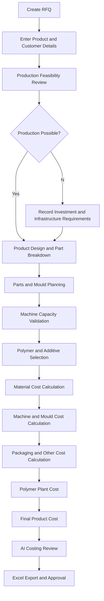
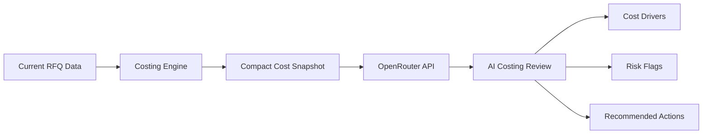

<p align="center">
  
</p>

<div align="center">

# AI Polymer Costing App

### Intelligent RFQ, Mould Planning and Plastic Product Costing Platform


<br>


</div>

---

## 🎥 Demo Preview


<a href="https://www.loom.com/share/bcd3a5eefaf94c69b55b33b9496be153" target="_blank">


</a>

👉 [Click here to watch full screen demo](https://www.loom.com/share/bcd3a5eefaf94c69b55b33b9496be153)

---


# Overview

AI Polymer Costing App is a secure enterprise web application designed to automate RFQ processing, production-feasibility assessment, injection-moulding planning, polymer material costing, machine-cost calculation, packaging-cost calculation, mould amortization, and final product-cost generation.

The application converts a traditional Excel-based molded-plastic costing workflow into a centralized Flask platform with structured master data, role-based permissions, audit logging, Excel export, email automation, version history, and an AI Costing Copilot powered by OpenRouter.

It supports polymer families such as PP, PE, PET, GPPS, ABS, PC, HDPE, LDPE, Acrylic, PMMA, and Elastomer.

---

# Business Objectives

- Automate plastic-product costing
- Replace manual Excel costing workflows
- Standardize RFQ evaluation
- Validate injection-moulding feasibility
- Select suitable machines by polymer and capacity
- Calculate material, machine, mould, packing, and other costs
- Track RFQ status from request to final costing
- Maintain controlled master data
- Generate Excel costing reports
- Improve costing accuracy and turnaround time
- Provide AI-assisted costing analysis
- Maintain secure user access and audit history

---

# Core Features

- RFQ Input Management
- Production Feasibility Analysis
- Product Manufacturing Design
- Parts and Mould Planning
- Product Material Costing
- Sampling Details
- Polymer Plant Costing
- Final Product Costing
- Injection Machine Capacity Validation
- Polymer Rate Management
- Masterbatch and Additive Costing
- Waste and Shrinkage Calculation
- Packaging Material Costing
- Mould Amortization
- Machine Production Costing
- RFQ Version History
- Excel Report Export
- Bulk RFQ Export
- Audit Logging
- Email Notifications
- Scheduled Email Digests
- Role-Based Access Control
- Per-Tab Permissions
- Per-Master Permissions
- AI Costing Copilot
- Docker Deployment

---

# Application Workflow



---

# System Architecture

```text
                         Business Users
                               │
                               ▼
                       Flask Web Interface
                               │
          ┌────────────────────┼────────────────────┐
          │                    │                    │
          ▼                    ▼                    ▼
      RFQ Workflow       Costing Engine       Administration
          │                    │                    │
          ▼                    ▼                    ▼
 Feasibility Review    Material Calculations  Users & Permissions
 Parts & Mould Plan    Machine Calculations   Master Data
 Sampling Details      Mould Amortization     Email Automation
          │                    │                    │
          └────────────────────┼────────────────────┘
                               ▼
                         SQLite Database
                               │
          ┌────────────────────┼────────────────────┐
          ▼                    ▼                    ▼
     Excel Export        OpenRouter AI        Audit History
```

---

# AI Costing Copilot

The integrated AI Costing Copilot reviews the live RFQ and calculated costing results.

It can:

- Summarize major cost drivers
- Identify material-cost risks
- Identify machine-capacity risks
- Detect missing or incomplete costing data
- Review mould and machine assumptions
- Highlight unusual cost components
- Suggest practical next actions
- Generate management-ready costing commentary

The AI request uses a compact costing snapshot rather than the complete RFQ record. API credentials remain on the Flask server and are never exposed to browser code.

---

# AI Copilot Workflow



---

# RFQ Modules

## RFQ Input

Captures:

- Requestor
- RFQ Number
- Product Reference
- Product Name
- Customer
- Sales Team
- Costing Purpose
- Material
- Net Weight
- Manufacturing Quantity
- Production Start Period
- Quantity Split
- Packaging Details
- Sample Quantity
- Colour Requirements
- Market Type
- Remarks and Instructions

---

## Production Feasibility

Evaluates whether the product can be manufactured using the current plant setup.

Supported decisions:

- Yes
- No
- Maybe

When production is not feasible, the application captures:

- Required investment
- Infrastructure requirement
- Lead time
- Technical limitations
- Cannot-do reason
- Feasibility remarks

Parts and material planning can be restricted when production is marked as not feasible.

---

## Product Manufacturing Design

Defines:

- Product parts
- Number of components
- Net weight per component
- Material family
- Mould type
- Product structure
- Two-shot grouping
- Part-level design information

---

## Parts and Mould Planning

Each part can contain multiple mould entries.

The module captures:

- Part name
- Part net weight
- Polymer family
- Machine size
- Machine name
- Cavities
- Cycle time
- Mould material
- Mould process
- Runner type
- Surface finish
- Previous mould number
- Family mould details
- Shared-with part
- Mould life
- Mould cost
- Machine lead time
- Technical remarks

---

# Machine Capacity Validation

Machine selection follows cascading filters:

```text
Polymer Family
      │
      ▼
Available Machine Sizes
      │
      ▼
Matching Machine Names
      │
      ▼
Injection Capacity Range
      │
      ▼
Part Weight × Cavities Validation
```

The application validates the required shot weight against the minimum and maximum injection capacity configured for the selected polymer and machine size.

```text
Required Shot Weight = Part Net Weight × Number of Cavities
```

A save is blocked when the required shot weight exceeds the machine's maximum injection capacity.

A warning is displayed when the shot weight is below the machine's recommended minimum capacity.

---

# Machine Master

The Machine Master contains:

- Polymer Type
- Machine Number
- Machine Type in MT
- Machine Name
- Machine Make
- Model
- Frame
- Screw Diameter
- Screw L/D Ratio
- Theoretical Displacement
- Injection Pressure
- Injection Rate
- Minimum Injection Capacity
- Maximum Injection Capacity
- Remarks

The same physical machine can have different injection-capacity ranges for different polymer densities.

---

# Product Material Costing

The material module supports:

- Primary Polymer
- Secondary Polymer 1
- Secondary Polymer 2
- Masterbatch
- Additive 1
- Additive 2
- Additive 3
- Other Material
- Component Weight
- Number of Components
- Material Percentage
- Rate per Kilogram
- Wastage Percentage
- Final Material Cost per Piece

Polymer percentages must total 100%.

---

# Material Cost Formula

```text
Polymer Cost
=
Component Weight in Kg
× Polymer Percentage
× Polymer Rate
```

Additives and masterbatch are applied to polymer weight:

```text
Additive Cost
=
Polymer Weight
× Additive Percentage
× Additive Rate
```

Total material cost includes configured wastage:

```text
Material Cost per Piece
=
Base Material Cost
× (1 + Wastage Percentage)
× Number of Components
```

---

# Waste Calculation

Waste Master supports:

- Material Shrinkage
- Burning Waste
- Startup Waste

Applied costing wastage:

```text
Applied Wastage
=
Burning Waste Percentage
+
Startup Waste Percentage
```

If a polymer is not configured, the application uses a conservative fallback based on the highest configured waste rate.

---

# Production Calculation

Production per day per mould:

```text
Production per Day
=
floor((22 × 60 × 60) ÷ Cycle Time in Seconds)
× Number of Cavities
```

Where:

```text
22 = Effective production hours per day
```

---

# Multi-Mould Machine Cost

When one part is produced using multiple moulds, machine cost is blended.

```text
Machine Cost per Piece
=
Sum of Daily Machine Costs
÷
Sum of Production per Day
```

This prevents machine cost from being incorrectly double-counted across multiple moulds.

---

# Plant Machine Cost Formula

```text
Daily Plant Machine Cost
=
Machine Master Rate
× 3
× Machine Size in MT
```

```text
Plant Machine Cost per Piece
=
Daily Plant Machine Cost
÷ Production per Day
```

For multiple moulds:

```text
Blended Plant Machine Cost per Piece
=
Sum of Plant Daily Costs
÷ Sum of Production per Day
```

---

# Mould Costing

The application calculates:

- Total Mould Cost
- Mould Cost per Piece on RFQ Quantity
- Mould Cost per Piece on Amortized Quantity
- Mould Requirement
- Mould Shortfall
- Available Moulds
- Family Moulds
- Reused Moulds

Mould amortization formula:

```text
Mould Cost per Piece
=
Total Mould Cost
÷
(Total Manufacturing Quantity × Amortization Years)
```

When a previous mould number is entered:

- Mould Required becomes No
- Family Mould becomes No
- Cost per Mould becomes zero

---

# Quantity Planning

The platform creates year-aware planning periods from the first production month.

If production begins at the start of a quarter, four complete quarters are generated.

If production begins in the middle of a quarter, the first period contains the remaining months, followed by full quarters and a final tail period.

Working-day assumptions:

| Period Length | Working Days |
|---|---:|
| One Month | 22 |
| Two Months | 43 |
| Full Quarter | 65 |

---

# Product Final Cost

```text
Final Product Cost per Piece
=
Material Cost
+
Machine Cost
+
Assembly Cost
+
Accessory Cost
+
Packing Material Cost
+
Packing Labour Cost
+
Other Costs
+
Mould Cost per Piece
```

---

# Costing Outputs

The application generates:

- Material Cost per Piece
- Machine Cost per Piece
- Assembly Cost
- Accessory Cost
- Packing Material Cost
- Packing Labour Cost
- Additional Cost
- Mould Cost per Piece
- Variable Cost
- Polymer Plant Cost
- Final Product Cost
- Production Capacity
- Capacity Shortfall
- Costing Summary
- Excel Costing Report

---

# Costing Tabs

## Cost as per Polymer Plant

Includes:

- Material Cost
- Assembly Cost
- Accessory Cost
- Packaging Costs
- Other Costs
- Mould Cost per Piece

This view excludes machine production cost from its displayed plant-variable-cost result.

---

## Product Final Cost from Plant

Includes:

- Latest Polymer Master Rate
- Admin Price Override
- Masterbatch Cost
- Additive Cost
- Other Material Cost
- Wastage
- Machine Production Cost
- Assembly Cost
- Packaging Cost
- Other Costs
- Mould Cost
- Final Cost per Piece

---

# Master Data

The platform includes the following master tables:

| Master | Purpose |
|---|---|
| Polymer Master | Polymer type, code, market rate, exchange rate, final INR rate and wastage |
| Machine Master | Injection-machine specifications and polymer-specific capacity |
| Machine Cost | Material and machine-size costing rates |
| Masterbatch | Masterbatch code and rate |
| Additives | Additive code, rate and notes |
| Other Material | Other material rates |
| Mould Material | Approved mould materials |
| Primary Packing | Primary packaging specifications and cost |
| Inner Packing | Inner packaging specifications and cost |
| Master Packing | Master carton specifications and cost |
| Waste Master | Shrinkage, burning and startup waste |
| RFQ Input Master | RFQ purpose options |
| Final Cost Text | Export and domestic costing notes |
| Outsource MT | Machine sizes allowed for outsourcing |
| Prepared By | Costing preparers |
| Sales Team | Sales-team codes and names |

---

# User Roles and Permissions

The application supports:

- Administrator
- Standard User

Administrators can control:

- User creation
- User activation
- User deletion
- Password reset
- RFQ creation permission
- Tab-level view permission
- Tab-level edit permission
- Master-level view permission
- Master-level edit permission
- Email automation
- RFQ deletion
- Master data management

---

# RFQ Tabs

| Tab | Purpose |
|---|---|
| RFQ Input | Product, customer, quantity and commercial input |
| Production Feasibility | Current setup and investment assessment |
| Product Design | Component and manufacturing design |
| Parts and Moulds | Mould, machine and cycle-time planning |
| Product Material | Polymer, masterbatch and additive costing |
| Sampling Detail | Sampling options, quantity, cost and lead time |
| Cost as per Polymer Plant | Polymer plant cost summary |
| Product Final Cost from Plant | Complete final product costing |

---

# Email Automation

The application provides SMTP-based email automation.

Supported job types:

- Weekly RFQ Digest
- RFQ Reminder
- Event Notification

Supported event examples:

- RFQ Created
- RFQ Saved
- RFQ Submitted
- Parts Saved
- Material Saved
- Costing Submitted

Email logs store:

- Recipient
- Subject
- Status
- Error
- Date and Time

---

# RFQ Version History

The application stores snapshots when important workflow events occur.

Examples:

- RFQ Submitted
- Feasibility Decision
- Plant Cost Submitted

The latest RFQ versions are retained for review and traceability.

---

# Security Features

- Session-Based Authentication
- Password Hashing
- CSRF Protection
- Five-Attempt Login Lockout
- Five-Minute IP Lockout
- Role-Based Access Control
- Tab-Level Permissions
- Master-Level Permissions
- Server-Side Permission Enforcement
- Secure API-Key Storage
- Audit Logging
- Request-Size Limits
- HTTP-Only Session Cookies
- SameSite Cookie Protection
- Secure Response Headers
- Open-Redirect Protection
- Per-User AI Request Limits

---

# Audit Logging

The audit log records:

- Login
- Logout
- Password Change
- RFQ Creation
- RFQ Save
- RFQ Submission
- Plant Cost Submission
- RFQ Deletion
- Master Data Changes
- Report Export
- Administrative Actions

---

# Technology Stack

| Layer | Technology |
|---|---|
| Programming Language | Python |
| Backend | Flask |
| Database | SQLite |
| Authentication | Flask Session and Werkzeug |
| Spreadsheet Processing | OpenPyXL |
| AI Integration | OpenRouter |
| Scheduler | APScheduler |
| Production Server | Gunicorn |
| Containerization | Docker and Docker Compose |
| Frontend | HTML, CSS and JavaScript |

---

# Project Structure

```text
costing_app/
│
├── app.py
├── requirements.txt
├── README.md
├── DOCKER.md
├── Dockerfile
├── docker-compose.yml
├── run.sh
├── .env.example
├── .gitignore
├── .dockerignore
│
├── data/
│   └── costing.db
│
├── static/
│   ├── css/
│   │   └── style.css
│   └── js/
│       └── rfq.js
│
└── templates/
    ├── base.html
    ├── login.html
    ├── dashboard.html
    ├── rfq_form.html
    ├── summary.html
    ├── masters_index.html
    ├── masters_edit.html
    ├── change_password.html
    ├── admin_users.html
    ├── admin_email.html
    └── error.html
```

---

# Environment Variables

Create a `.env` file:

```env
COSTING_SECRET=generate_a_secure_random_secret

OPENROUTER_API_KEY=your_openrouter_api_key

OPENROUTER_MODEL=nvidia/nemotron-3-nano-30b-a3b:free

OPENROUTER_MAX_TOKENS=1200

OPENROUTER_REQUESTS_PER_HOUR=20

COSTING_DEMO_DATA=0
```

Generate a secure application secret:

```bash
python -c "import secrets; print(secrets.token_hex(32))"
```

Never commit `.env`, API keys, production databases, or passwords to GitHub.

---

# Installation

## Clone Repository

```bash
git clone https://github.com/yourusername/ai-polymer-costing-app.git
```

```bash
cd ai-polymer-costing-app
```

## Create Virtual Environment

```bash
python -m venv .venv
```

### Windows

```bash
.venv\Scripts\activate
```

### Linux or macOS

```bash
source .venv/bin/activate
```

## Install Dependencies

```bash
pip install -r requirements.txt
```

## Run Application

```bash
python app.py
```

Open:

```text
http://127.0.0.1:5000
```

---

# Linux Quick Start

```bash
chmod +x run.sh
```

```bash
./run.sh
```

The script creates the virtual environment, installs dependencies, and starts the Flask application.

---

# Docker Deployment

Copy the example environment file:

```bash
cp .env.example .env
```

Build and run:

```bash
docker compose up --build -d
```

Open:

```text
http://localhost:5000
```

View logs:

```bash
docker compose logs -f
```

Check status:

```bash
docker compose ps
```

Stop:

```bash
docker compose down
```

Remove the container and database volume:

```bash
docker compose down -v
```

> The `-v` command permanently removes persisted application data.

---

# Database Persistence

The SQLite database is stored at:

```text
/app/data/costing.db
```

Docker uses a persistent volume so RFQs, users, master data, permissions, schedules, and audit history survive container rebuilds.

---

# Database Backup

```bash
docker compose exec costing sh -c 'cat /app/data/costing.db' > costing-backup.db
```

For production environments, schedule regular encrypted backups.

---

# Default Login

```text
Employee ID: admin
Password: admin123
Role: Administrator
```

Change the default password immediately after installation.

The project may also seed additional demonstration users. Remove or change all default credentials before production deployment.

---

# Requirements

```txt
Flask==3.0.3
openpyxl==3.1.5
Werkzeug==3.0.4
gunicorn==22.0.0
APScheduler==3.10.4
```

---

# Production Deployment

Use Gunicorn:

```bash
gunicorn -w 2 --threads 4 -b 0.0.0.0:5000 app:app
```

Recommended production setup:

```text
User
  │
  ▼
HTTPS Reverse Proxy
  │
  ▼
Gunicorn
  │
  ▼
Flask Application
  │
  ▼
SQLite / PostgreSQL
```

Production recommendations:

- Configure HTTPS
- Enable secure session cookies
- Change all seeded passwords
- Use a persistent `COSTING_SECRET`
- Protect the OpenRouter API key
- Schedule database backups
- Restrict network access
- Use PostgreSQL for horizontal scaling
- Configure SMTP with an application password
- Monitor AI usage and email logs

---

# Supported Industries

- Plastic Injection Moulding
- Stationery Manufacturing
- Consumer Products
- Packaging Products
- Houseware Products
- Educational Products
- Automotive Components
- Medical Plastic Components
- Industrial Plastic Products
- Custom Moulded Products

---

# Future Enhancements

- Polymer Price API Integration
- ERP Integration
- SAP Integration
- Automated Quotation Generation
- Customer Approval Workflow
- Multi-Currency Costing
- Cost Variance Analysis
- Supplier Quotation Comparison
- AI Cost Optimization
- Predictive Polymer Pricing
- Advanced Cost Dashboards
- PDF Quotation Export
- Digital Approval Signatures
- Enterprise SSO
- PostgreSQL Support
- Kubernetes Deployment
- Mobile Application
- Power BI Integration

---

# Developer

## SNEHAL LAXMAN JADHAV

### AI Engineer

### Navneet Education Limited

---

# License

Internal enterprise use. Redistribution is not permitted unless authorized by the project owner.

---

<div align="center">

# Intelligent Costing for Modern Manufacturing

### Accurate Polymer Costs. Smarter Mould Planning. Faster RFQ Decisions.

**Python • Flask • SQLite • OpenPyXL • OpenRouter • APScheduler • Docker**

<br>


</div>

<p align="center">
  
</p>
